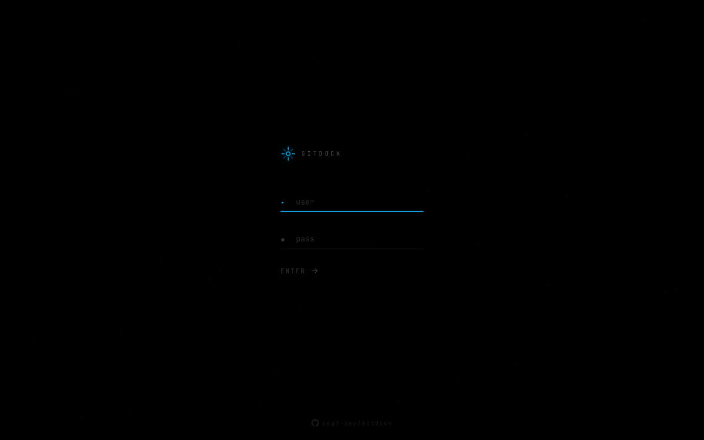
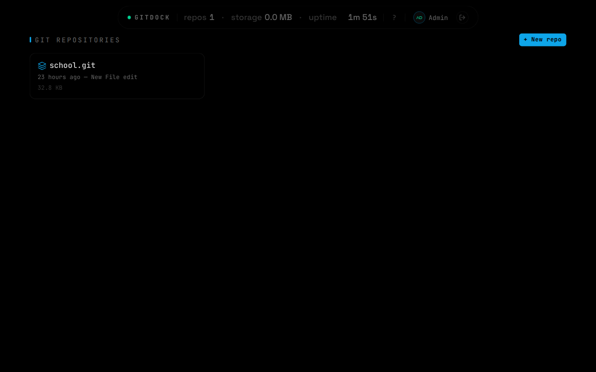
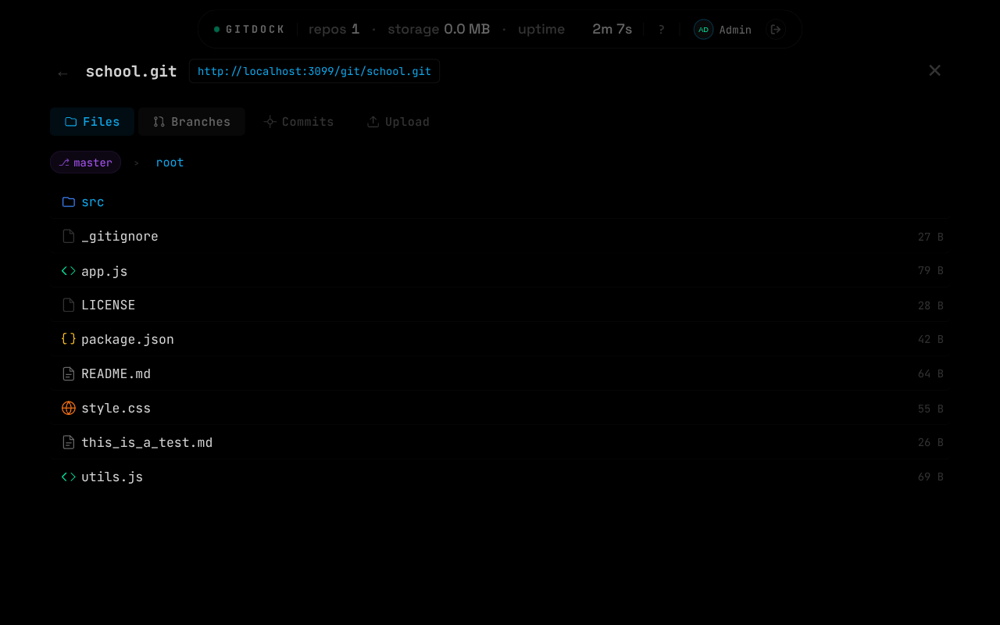
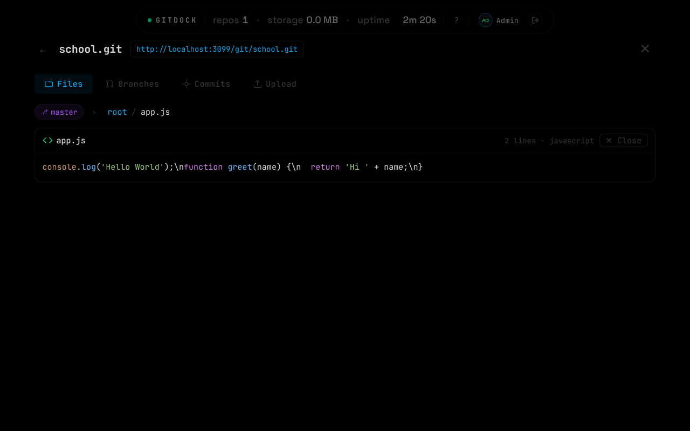
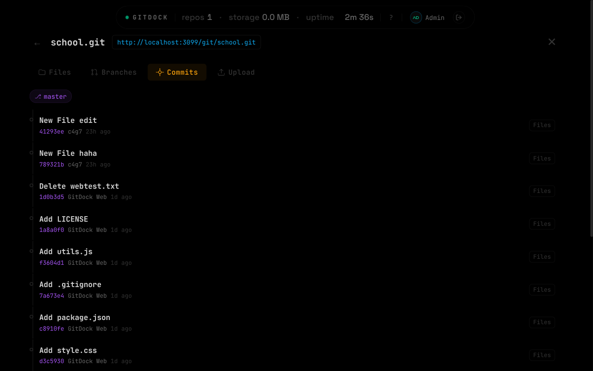

# GitDock

> Self-hosted Git repository manager & file vault with a stunning AMOLED dark UI.


## What is GitDock?

GitDock is a lightweight, self-hosted Git server and file upload vault packed into a single `server.js` file. It features a modern AMOLED-black dashboard with smooth animations, commit history browsing, branch management, and session-based authentication — all without any build step or external database.

## Screenshots

| Login | Dashboard |
|:---:|:---:|
|  |  |

| File Browser | File Viewer |
|:---:|:---:|
|  |  |

| Commit History |
|:---:|
|  |

## Features

- **Git hosting** — Push/pull repos over HTTP with Basic auth
- **File vault** — Upload, download, and share files via the web UI
- **Commit history** — Browse commits, diffs, and file changes per repo
- **Branch selector** — Switch branches with a polished pill-style selector
- **Authentication** — Session-based login with scrypt password hashing
- **User profile** — Avatar (DiceBear), display name, password management
- **AMOLED dark theme** — Pure black UI with green/blue/purple accents
- **Responsive** — Works on desktop and mobile
- **Zero dependencies aside from Express, Multer, and adm-zip**

## Quick Start

```bash
# Clone
git clone https://github.com/c4g7-dev/GitDock.git
cd GitDock

# Install
npm install

# Run
PORT=3099 node server.js
```

Open `http://localhost:3099` — default login is `admin` / `admin`.

## Stack

| Layer     | Tech                          |
|-----------|-------------------------------|
| Runtime   | Node.js 24                    |
| Framework | Express 5                     |
| Auth      | scrypt (node:crypto), cookies |
| Storage   | File system + JSON            |
| UI        | Vanilla HTML/CSS/JS (inline)  |

## Project Structure

```
server.js       — The entire backend + embedded frontend
storage/
  repos/        — Bare git repositories
  files/        — Uploaded files
  users.json    — User credentials (auto-created)
```

## Deployment

### Systemd (Linux server)

```bash
# Copy files to server
scp server.js package.json root@YOUR_SERVER:/opt/gitdock/
ssh root@YOUR_SERVER

# Install dependencies
cd /opt/gitdock
mkdir -p storage/{repos,files,tmp}
npm install --omit=dev

# Create systemd service
cat > /etc/systemd/system/gitdock.service << 'EOF'
[Unit]
Description=GitDock - Self-hosted Git + File Vault
After=network.target

[Service]
Type=simple
User=root
WorkingDirectory=/opt/gitdock
ExecStart=/usr/bin/node /opt/gitdock/server.js
Restart=always
RestartSec=5
Environment=PORT=3099
Environment=STORAGE_DIR=/opt/gitdock/storage

[Install]
WantedBy=multi-user.target
EOF

systemctl daemon-reload
systemctl enable --now gitdock
```

### Reverse Proxy

Point your reverse proxy at `http://127.0.0.1:3099`.

<details>
<summary><b>Nginx</b></summary>

**HTTP only:**
```nginx
server {
    listen 80;
    server_name git.example.com;

    client_max_body_size 100M;

    location / {
        proxy_pass http://127.0.0.1:3099;
        proxy_set_header Host $host;
        proxy_set_header X-Real-IP $remote_addr;
        proxy_set_header X-Forwarded-For $proxy_add_x_forwarded_for;
        proxy_set_header X-Forwarded-Proto $scheme;
    }
}
```

**With HTTPS (Let's Encrypt):**
```nginx
server {
    listen 80;
    server_name git.example.com;
    return 301 https://$host$request_uri;
}

server {
    listen 443 ssl http2;
    server_name git.example.com;

    ssl_certificate     /etc/letsencrypt/live/git.example.com/fullchain.pem;
    ssl_certificate_key /etc/letsencrypt/live/git.example.com/privkey.pem;

    client_max_body_size 100M;

    location / {
        proxy_pass http://127.0.0.1:3099;
        proxy_set_header Host $host;
        proxy_set_header X-Real-IP $remote_addr;
        proxy_set_header X-Forwarded-For $proxy_add_x_forwarded_for;
        proxy_set_header X-Forwarded-Proto $scheme;
    }
}
```
</details>

<details>
<summary><b>Traefik</b></summary>

**Docker labels (HTTP):**
```yaml
labels:
  - "traefik.enable=true"
  - "traefik.http.routers.gitdock.rule=Host(`git.example.com`)"
  - "traefik.http.routers.gitdock.entrypoints=web"
  - "traefik.http.services.gitdock.loadbalancer.server.port=3099"
```

**Docker labels (HTTPS with automatic Let's Encrypt):**
```yaml
labels:
  - "traefik.enable=true"
  - "traefik.http.routers.gitdock.rule=Host(`git.example.com`)"
  - "traefik.http.routers.gitdock.entrypoints=websecure"
  - "traefik.http.routers.gitdock.tls.certresolver=letsencrypt"
  - "traefik.http.services.gitdock.loadbalancer.server.port=3099"
```

**File provider (`gitdock.yml`):**
```yaml
http:
  routers:
    gitdock:
      rule: "Host(`git.example.com`)"
      service: gitdock
      entryPoints:
        - websecure
      tls:
        certResolver: letsencrypt
  services:
    gitdock:
      loadBalancer:
        servers:
          - url: "http://127.0.0.1:3099"
```
</details>

<details>
<summary><b>HAProxy</b></summary>

**HTTP only:**
```haproxy
frontend http_front
    bind *:80
    acl is_gitdock hdr(host) -i git.example.com
    use_backend gitdock_back if is_gitdock

backend gitdock_back
    server gitdock 127.0.0.1:3099 check
    http-request set-header X-Real-IP %[src]
    http-request set-header X-Forwarded-Proto http
```

**With HTTPS (SSL termination):**
```haproxy
frontend https_front
    bind *:443 ssl crt /etc/haproxy/certs/git.example.com.pem
    acl is_gitdock hdr(host) -i git.example.com
    use_backend gitdock_back if is_gitdock

frontend http_front
    bind *:80
    redirect scheme https code 301

backend gitdock_back
    server gitdock 127.0.0.1:3099 check
    http-request set-header X-Real-IP %[src]
    http-request set-header X-Forwarded-Proto https
```
</details>

## License

MIT
